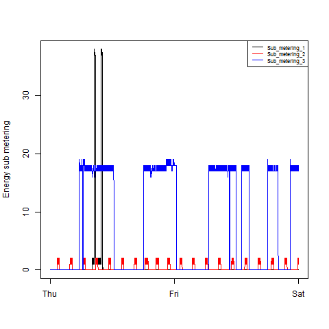
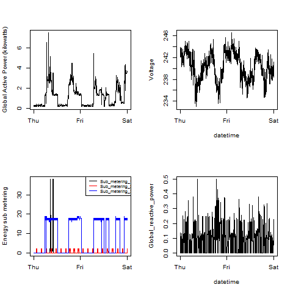

## Introduction
###  Submitted by Ron Rick Chua

R Codes are located under the Forked Version 

[https://github.com/RXCORE/ExData_Plotting1/MYPROJECT](https://github.com/RXCORE/ExData_Plotting1/MYPROJECT).

And the Plot images are located under
[https://github.com/RXCORE/ExData_Plotting1/MYPROJECT/PLOTS](https://github.com/RXCORE/ExData_Plotting1/MYPROJECT/PLOTS).

## Plots that have been generated using R programming

### Plot 1: Histogram of Global Active Power

### Plot 2: Line Graph of Global Active Power

### Plot 3: Line Graph of 3 Energy Sub-Metering 

### Plot 4: Combinations of four graphs (Global Active Power, Voltage, Energy Sub-Metering, and Global Reactive Power) 

## This Class is AWSOME!!!
## THANKS!!!
